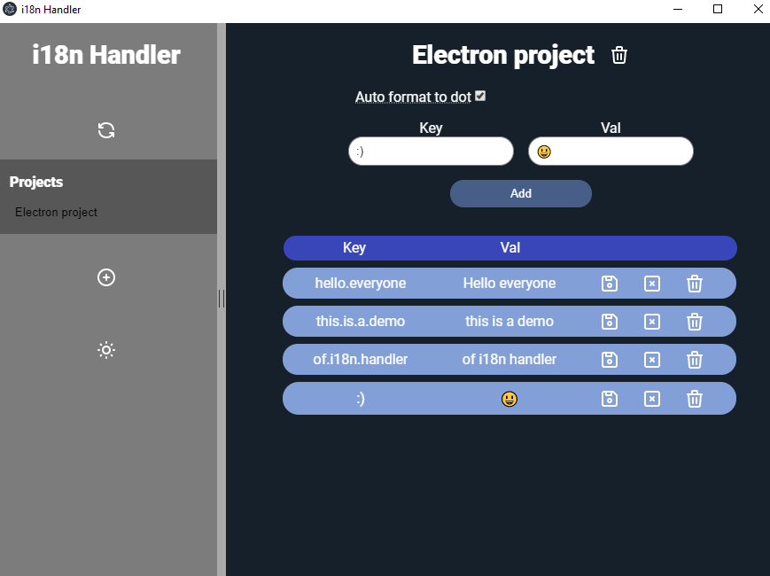

> WORK IN PROGRESS ⚠️ Expect breaking changes ⚠️
# 🔱 i18n Spin Handler 🔱

 **i18n Spin Handler** is an electron app to handle the translations for multiple projects with a future feature of auto-translation.
 


## 🎉 Features

- Multiple languages
- Export the projects as JSON (soon)


## 📦 Installation

Create an executable:

```bash
npm run dist
```
Then the .exe will be located in ~\i18n-spin-ts\out\i18n-spints-win32-x64\i18n-spints.exe


Please give it a [⭐ Star](https://github.com/aspnxdd/i18n-spin) if you like it :)

Made by [me](https://github.com/aspnxdd)

MIT License
